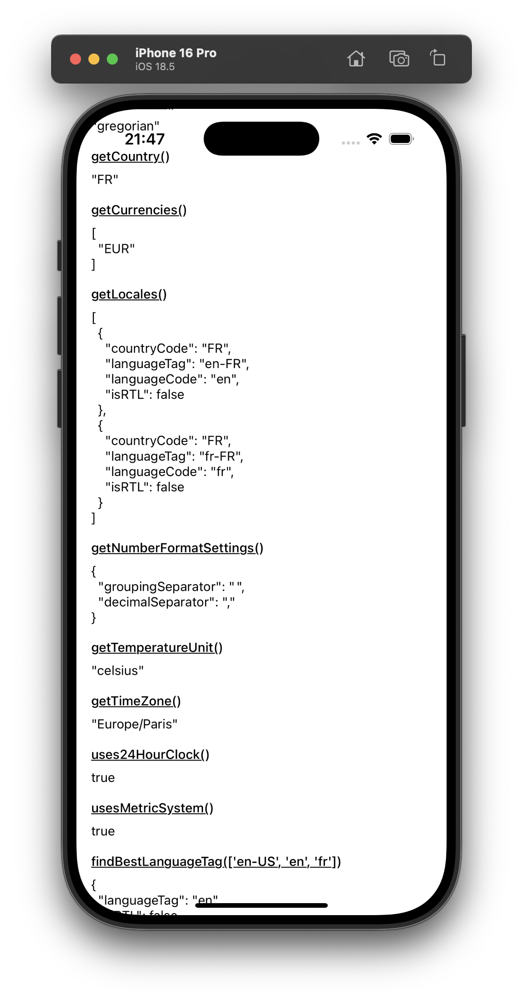
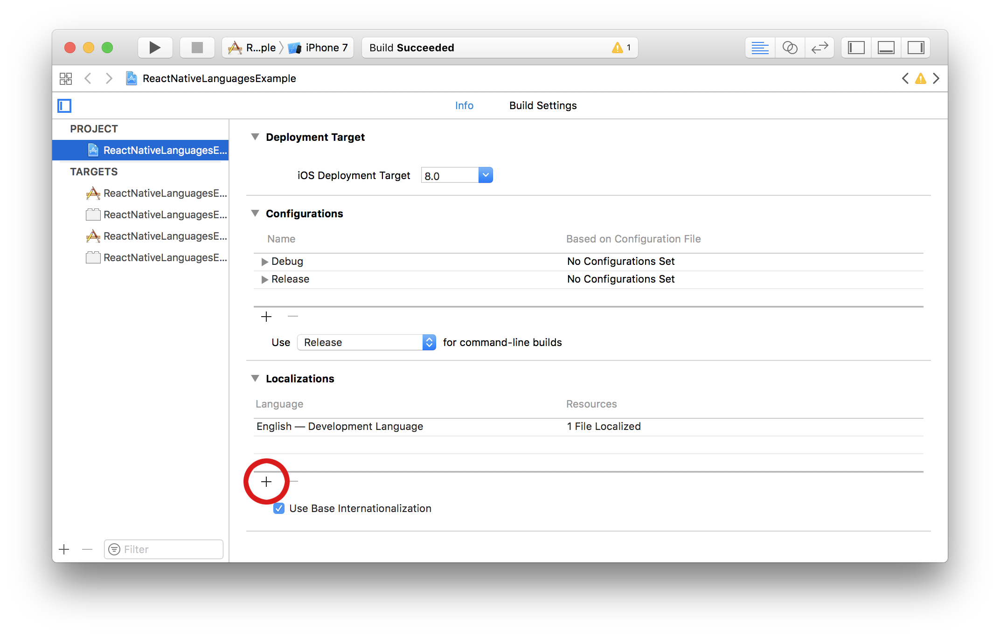

# 🌍  react-native-localize

A toolbox for your React Native app localization.

[](https://github.com/zoontek/react-native-localize/blob/main/LICENSE)
[](https://www.npmjs.org/package/react-native-localize)
[](https://www.npmjs.org/package/react-native-localize)
<br />
[](https://www.android.com)
[](https://developer.apple.com/ios)
[](https://developer.apple.com/macos)
[](https://developer.mozilla.org)



## Support

This library follows the React Native [releases support policy](https://github.com/reactwg/react-native-releases/blob/main/docs/support.md).<br>
It is supporting the **latest version**, and the **two previous minor series**.

## Setup

```bash
$ npm install --save react-native-localize
# --- or ---
$ yarn add react-native-localize
```

_Don't forget to run `pod install` after that !_

### Expo plugin

If you're using Expo, you can specify the supported locales in your `app.json` or `app.config.js` using the config plugin.
This enables Android 13+ and iOS to display the available locales in the system settings, allowing users to select their preferred language for your app.

```json
{
  "expo": {
    "plugins": [["react-native-localize", { "locales": ["en", "fr"] }]]
  }
}
```

Alternatively, if you want to define different locales for iOS and Android, you can use:

```json
{
  "expo": {
    "plugins": [
      [
        "react-native-localize",
        {
          "locales": {
            "android": ["en"],
            "ios": ["en", "fr"]
          }
        }
      ]
    ]
  }
}
```

### Web support

This package supports `react-native-web`. Follow their [official guide](https://necolas.github.io/react-native-web/docs/multi-platform/#compiling-and-bundling) to configure `webpack`.

## Basic usage example

```ts
import { getCurrencies, getLocales } from "react-native-localize";

console.log(getLocales());
console.log(getCurrencies());
```

## Add smart, AI-powered translations to your app

<a href="https://www.prismy.io/?r=rnl">
  
</a>

<br />

[Prismy](https://www.prismy.io/?r=rnl) (a proud sponsor of this library ♥️) helps teams ship localized apps faster with an AI-driven, GitHub-native workflow. Want to supercharge your `react-native-localize` setup? Here's how Prismy makes localization seamless:

### 🚀 Smart translations with zero fuss

- Customize tone (formal, informal, playful) per language.
- Automatically reuse existing translations.
- Use glossaries to keep terminology consistent (Prismy even generates them the initial one for you!)

No setup headaches. Just clean, context-aware translations, out of the box.

### 🔁 Continuous localization, built for developers

1. Keep editing your source locale files like you always do.
2. When you open a PR, Prismy:
   - Detects missing translations
   - (Optionally) adds a "Missing Translations" CI check
   - Comments with a link to generate them in one click
3. Kick off translations from the PR comment itself.
4. Let PMs, designers, or translators tweak the wording via Prismy's web UI.

👉 Learn more at [prismy.io](https://www.prismy.io/?r=rnl)

## API

### getCalendar()

Returns the user preferred calendar format.

#### Method type

```ts
type getCalendar = () =>
  | "gregorian"
  | "buddhist"
  | "coptic"
  | "ethiopic"
  | "ethiopic-amete-alem"
  | "hebrew"
  | "indian"
  | "islamic"
  | "islamic-umm-al-qura"
  | "islamic-civil"
  | "islamic-tabular"
  | "iso8601"
  | "japanese"
  | "persian";
```

#### Usage example

```ts
import { getCalendar } from "react-native-localize";

console.log(getCalendar());
// -> "gregorian"
```

---

### getCountry()

Returns the user current country code (based on its device locale, **not** on its position).

#### Method type

```ts
type getCountry = () => string;
```

#### Usage example

```ts
import { getCountry } from "react-native-localize";

console.log(getCountry());
// -> "FR"
```

#### Note

Devices using Latin American regional settings will return "UN" instead of "419", as the latter is not a standard country code.

---

### getCurrencies()

Returns the user preferred currency codes, in order.

#### Method type

```ts
type getCurrencies = () => string[];
```

#### Usage example

```ts
import { getCurrencies } from "react-native-localize";

console.log(getCurrencies());
// -> ["EUR", "GBP", "USD"]
```

---

### getLocales()

Returns the user preferred locales, in order.

#### Method type

```ts
type getLocales = () => Array<{
  languageCode: string;
  scriptCode?: string;
  countryCode: string;
  languageTag: string;
  isRTL: boolean;
}>;
```

#### Usage example

```ts
import { getLocales } from "react-native-localize";

console.log(getLocales());
/* -> [
  { countryCode: "GB", languageTag: "en-GB", languageCode: "en", isRTL: false },
  { countryCode: "US", languageTag: "en-US", languageCode: "en", isRTL: false },
  { countryCode: "FR", languageTag: "fr-FR", languageCode: "fr", isRTL: false },
] */
```

---

### getNumberFormatSettings()

Returns number formatting settings.

#### Method type

```ts
type getNumberFormatSettings = () => {
  decimalSeparator: string;
  groupingSeparator: string;
};
```

#### Usage example

```ts
import { getNumberFormatSettings } from "react-native-localize";

console.log(getNumberFormatSettings());
/* -> {
  decimalSeparator: ".",
  groupingSeparator: ",",
} */
```

---

### getTemperatureUnit()

Returns the user preferred temperature unit.

#### Method type

```ts
type getTemperatureUnit = () => "celsius" | "fahrenheit";
```

#### Usage example

```ts
import { getTemperatureUnit } from "react-native-localize";

console.log(getTemperatureUnit());
// -> "celsius"
```

---

### getTimeZone()

Returns the user preferred timezone (based on its device settings, **not** on its position).

#### Method type

```ts
type getTimeZone = () => string;
```

#### Usage example

```ts
import { getTimeZone } from "react-native-localize";

console.log(getTimeZone());
// -> "Europe/Paris"
```

---

### uses24HourClock()

Returns `true` if the user prefers 24h clock format, `false` if they prefer 12h clock format.

#### Method type

```ts
type uses24HourClock = () => boolean;
```

#### Usage example

```ts
import { uses24HourClock } from "react-native-localize";

console.log(uses24HourClock());
// -> true
```

---

### usesMetricSystem()

Returns `true` if the user prefers metric measure system, `false` if they prefer imperial.

#### Method type

```ts
type usesMetricSystem = () => boolean;
```

#### Usage example

```ts
import { usesMetricSystem } from "react-native-localize";

console.log(usesMetricSystem());
// -> true
```

---

### usesAutoDateAndTime()

Tells if the automatic date & time setting is enabled on the phone. **Android only**

#### Method type

```ts
type usesAutoDateAndTime = () => boolean | undefined;
```

#### Usage example

```ts
import { usesAutoDateAndTime } from "react-native-localize";

console.log(usesAutoDateAndTime()); // true or false
```

---

### usesAutoTimeZone()

Tells if the automatic time zone setting is enabled on the phone. **Android only**

#### Method type

```ts
type usesAutoTimeZone = () => boolean | undefined;
```

#### Usage example

```ts
import { usesAutoTimeZone } from "react-native-localize";

console.log(usesAutoTimeZone());
```

---

### findBestLanguageTag()

Returns the best language tag possible and its reading direction. Useful to pick the best translation available.

> [!NOTE]
>
> It respects the user preferred languages list order (see [explanations](https://github.com/zoontek/react-native-localize/issues/57#issuecomment-508456427)).

#### Method type

```ts
type findBestLanguageTag = (
  languageTags: string[],
) => { languageTag: string; isRTL: boolean } | undefined;
```

#### Usage example

```ts
import { findBestLanguageTag } from "react-native-localize";

console.log(findBestLanguageTag(["en-US", "en", "fr"]));
// -> { languageTag: "en-US", isRTL: false }
```

---

### openAppLanguageSettings()

Opens the app language settings.

> [!WARNING]
>
> This feature is available only on Android 13+ and require [configuring your app's supported locales](https://developer.android.com/guide/topics/resources/app-languages#use-localeconfig).

#### Method type

```ts
type openAppLanguageSettings = () => Promise<void>;
```

#### Usage example

```ts
import { openAppLanguageSettings } from "react-native-localize";

openAppLanguageSettings("application").catch((error) => {
  console.warn("Cannot open app language settings", error);
});
```

## Server-side rendering

On the client, `react-native-localize` uses `navigator.languages`. During SSR, it gets language preferences from the server via the parsed `Accept-Language` header.

#### 1. Wrap your app with `ServerLanguagesProvider`

On the server, wrap your app with `ServerLanguagesProvider` and pass the user's languages:

```tsx
import accepts from "accepts";
import { ServerLanguagesProvider } from "react-native-localize";

// parse the Accept-Language header; any approach returning string[] is fine
const languages = accepts(request).languages();

const html = renderToString(
  <ServerLanguagesProvider value={languages}>
    <App />
  </ServerLanguagesProvider>,
);
```

#### 2. Use the `useLocalize` hook in your components

In your components, use the `useLocalize` hook instead of calling the API methods directly:

```tsx
import { useLocalize } from "react-native-localize";

const App = () => {
  const { getCountry } = useLocalize();
  return <Text>Country: {getCountry()}</Text>;
};
```

## Examples with [@formatjs/intl](https://formatjs.io/docs/intl)

Browse the files in the [/example](https://github.com/zoontek/react-native-localize/tree/master/example) directory.

## How to update supported localizations (iOS)

You can add / remove supported localizations in your Xcode project infos:



## How to test your code

Because it's a native module, you need to mock this package.<br />
The package provides a default mock you may import in your `__mocks__` directory:

```ts
// __mocks__/react-native-localize.ts
export * from "react-native-localize/mock"; // or "react-native-localize/mock/jest"
```

## Sponsors

This module is provided **as is**, I work on it in my free time.

If you or your company uses it in a production app, consider sponsoring this project 💰. You also can contact me for **premium** enterprise support: help with issues, prioritize bugfixes, feature requests, etc.

<a href="https://github.com/sponsors/zoontek"></a>
